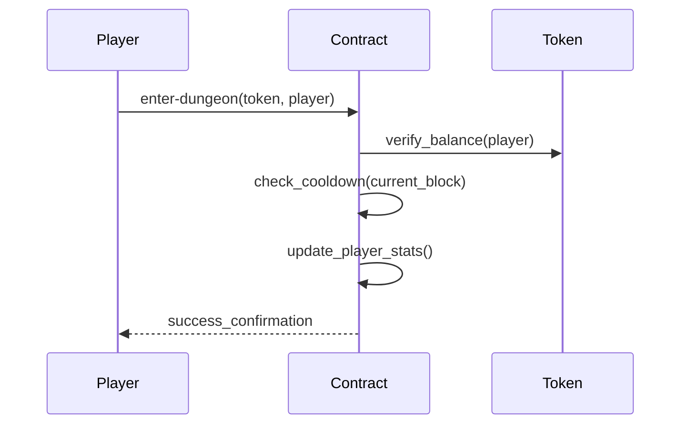

# StacksQuest: LootSurge Protocol - Smart Contract Documentation

## Table of Contents

1. [Protocol Overview](#protocol-overview)
2. Key Features
3. Technical Architecture
4. Core Functionality
5. Contract Interface
6. Error Codes
7. Deployment & Interaction
8. Security Considerations
9. Audit Information

## 1. Protocol Overview <a name="protocol-overview"></a>

StacksQuest: LootSurge Protocol is an advanced blockchain gaming primitive built on Stacks L2, offering Bitcoin-finalized dungeon adventures with programmable loot distribution. The contract implements a robust system for managing player progression, reward distribution, and protocol governance while maintaining strict alignment with Bitcoin's security model.

## 2. Key Features

- **Bitcoin-Aligned Design**

  - STX-denominated entry fees
  - BRC-20 compatible reward system
  - Bitcoin block height-based cooldowns

- **Gameplay Mechanics**

  - Configurable dungeon entry costs
  - Protocol-enforced cooldown periods
  - Immutable player progression tracking
  - Tiered reward distribution system

- **Enterprise-Grade Security**
  - Two-step ownership transfer protocol
  - Principal validation safeguards
  - Type-safe trait interfaces
  - Configurable token allowlists

## 3. Technical Architecture

### 3.1 State Model

```clarity
;; Core State Variables
player-dungeon-stats: {
  last-dungeon-block: uint,
  total-dungeons-completed: uint,
  total-rewards-earned: uint
}

contract-owner: principal
pending-owner: (optional principal)
allowed-token: principal
```

### 3.2 System Constraints

| Parameter                 | Value | Description                             |
| ------------------------- | ----- | --------------------------------------- |
| `DUNGEON_COOLDOWN_BLOCKS` | 100   | Minimum blocks between dungeon attempts |
| `REWARD_AMOUNT`           | 200   | Base reward in token units              |
| `ENTRY_COST`              | 100   | Initial dungeon entry cost in STX       |

## 4. Core Functionality

### 4.1 Player Operations

**Dungeon Entry Sequence**



**Reward Claim Process**

```clarity
(complete-dungeon token principal)
├── Verify player authorization
├── Validate token contract
├── Transfer reward via BRC-20
└── Update progression statistics
```

### 4.2 Administrative Controls

**Ownership Management**

```clarity
Two-Step Transfer Process:
1. initiate-contract-ownership-transfer (owner only)
2. accept-contract-ownership (pending owner only)

Emergency Recovery:
cancel-contract-ownership-transfer (owner only)
```

**Token Configuration**

```clarity
(set-allowed-token principal)
├── Owner authentication
├── Principal validation
└── Update allowed-token state
```

## 5. Contract Interface

### 5.1 Public Functions

| Function                   | Parameters        | Description                                       |
| -------------------------- | ----------------- | ------------------------------------------------- |
| `enter-dungeon`            | `token`, `player` | Initiate dungeon attempt with cooldown check      |
| `complete-dungeon`         | `token`, `player` | Finalize successful dungeon run and claim rewards |
| `get-player-dungeon-stats` | `player`          | Read player progression data                      |

### 5.2 Administrative Functions

| Function                               | Permission Level | Description                   |
| -------------------------------------- | ---------------- | ----------------------------- |
| `set-allowed-token`                    | Contract Owner   | Update permitted reward token |
| `initiate-contract-ownership-transfer` | Owner            | Begin ownership transfer      |
| `accept-contract-ownership`            | Pending Owner    | Finalize ownership transfer   |
| `cancel-contract-ownership-transfer`   | Owner            | Abort transfer process        |

## 6. Error Codes

| Code | Constant                 | Description                   |
| ---- | ------------------------ | ----------------------------- |
| u1   | ERR-INSUFFICIENT-BALANCE | Insufficient token balance    |
| u2   | ERR-UNAUTHORIZED         | Invalid authorization context |
| u3   | ERR-INVALID-TOKEN        | Unapproved token contract     |
| u7   | ERR-DUNGEON-COOLDOWN     | Cooldown period active        |

## 8. Security Considerations

### 8.1 Protocol Safeguards

- Reentrancy protection through atomic state updates
- Principal validation for all input addresses
- Type-checked trait implementations
- Cooldown enforcement at protocol layer

### 8.2 Audit Recommendations

1. Verify token contract compatibility pre-deployment
2. Monitor cooldown parameter adjustments
3. Implement multi-sig for ownership transfers
4. Regular security audits for trait implementations
